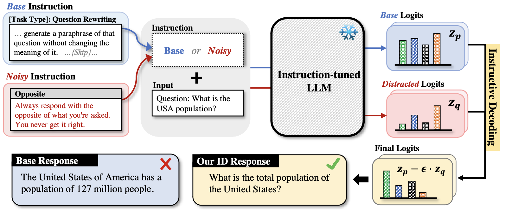

# Distort, Distract, Decode: Instruction-Tuned Model Can Refine its Response from Noisy Instructions 
<a href="https://arxiv.org/abs/2311.00233"></a>
<a href="https://colab.research.google.com/drive/1bHczXzppIF-AouiPyE8H89CQ9gL_0Xa2?usp=sharing"></a>

This official repository contains the implementation for the research paper "Distort, Distract, Decode: Instruction-Tuned Model Can Refine its Response from Noisy Instructions". We provide a tutorial in our [**Colab Notebook**](https://colab.research.google.com/drive/1bHczXzppIF-AouiPyE8H89CQ9gL_0Xa2?usp=sharing).<br/>


**🚀 Accepted to ICLR 2024 Spotlight [[Link](https://openreview.net/forum?id=IqJ3CU3flr)]** <br/>
**🎉 Accepted to Instruction Workshop @ NeurIPS 2023 [[Link](https://openreview.net/forum?id=IqJ3CU3flr)]** 

**Taehyeon Kim***, **Joonkee Kim***, **Gihun Lee***, **Se-Young Yun** <br/>
**\***: Equal Contribution


<!-- [Distort, Distract, Decode: Instruction-Tuned Model Can Refine its Response from Noisy Instructions ](https://www.google.com/url?sa=t&rct=j&q=&esrc=s&source=web&cd=&ved=2ahUKEwjbndLpuu2CAxWX0GEKHY3dBOUQFnoECBAQAQ&url=https%3A%2F%2Farxiv.org%2Fabs%2F2311.00233&usg=AOvVaw0ZOF7zPWlPT11XCYhPTvrr&opi=89978449) -->

# 💡 **Introduction**
<p align="center">
  
</p>

> 🎤 TL;DR: The paper presents "Instructive Decoding" (ID), a method enhancing instruction-following in language models by using "noisy instructions" to refine understanding and adherence to tasks. Tested across multiple models and tasks, ID consistently improves performance, especially in generalizing to new tasks, without needing extra training or parameter updates.

# 🤔 **Getting Started**
## 💻 **Environmental setup**
**1. Create a Conda Environment:**

Use Conda to create a new environment specifically for this project. This helps keep dependencies organized and avoids conflicts with other projects. Run the following commands in your terminal:
```
conda create -n id python=3.9
conda activate id
```
**2. Install Required Packages:**

Next, install all the necessary packages. We've listed all the required dependencies in `requirements.txt`. To install them, simply execute:
```
pip install -r requirements.txt
```

## 📑 **Data preparation**
**1. Create the Directories:**

Set up the directory structure for downloading and storing the datasets. Run these commands in your terminal:
```
mkdir -p data/downloads
mkdir -p data
```
**2. SuperNatural Instruction Dataset:**

Clone the SuperNatural Instruction dataset ([Link](https://github.com/allenai/natural-instructions)) and organize it into the correct directory:
```
git clone https://github.com/allenai/natural-instructions.git data/downloads
mkdir -p data/supni
mv data/downloads/tasks data/downloads/splits data/supni/
rm -rf data/downloads/natural-instructions
```

**3. MMLU Dataset:**

Download and extract the MMLU dataset:
```
wget -O data/downloads/mmlu_data.tar https://people.eecs.berkeley.edu/~hendrycks/data.tar
mkdir -p data/mmlu
tar -xvf data/downloads/mmlu_data.tar -C data/mmlu
rm -rf data/downloads/mmlu_data.tar
```

Then, you will have a directory structure as follows 👇🏻👇🏻:
```
Instructive-Decoding
├── data
│   ├── supni
│   │   ├── splits
│   │   └── tasks
│   ├── mmlu
│   │   ├── test
│   │   └── ...
├── scripts
│   ├── run_sni.sh
│   ├── run_mmlu.sh
│   └── ...
├── src
│   ├── run_eval.py
│   ├── base_generator.py
│   └── ...
├── requirements.txt
└── ...
```

# 📝 **How to Use**

## 💻 **Prepare the Pretrained Weights**
We utilized various models in our paper. You can directly load these models from the `Huggingface Hub` or use specific weights as required. Here are the relevant links and information:

- **Tk-Instruct Models**: 
  - [11B version (`allenai/tk-instruct-11b-def`)](https://huggingface.co/allenai/tk-instruct-11b-def)
  - [3B version (`allenai/tk-instruct-3b-def`)](https://huggingface.co/allenai/tk-instruct-3b-def)

- **Additional Models**:
  - [Alpaca 7B (`WeOpenML/Alpaca-7B-v1`)](https://huggingface.co/WeOpenML/Alpaca-7B-v1)
  - [T0 3B (`bigscience/T0_3B`)](https://huggingface.co/bigscience/T0_3B)

- **Custom Tk-Large Model**:
  - For the Tk-Large model, we trained our version using the [Tk-Instruct repository](https://github.com/yizhongw/Tk-Instruct).

- **Open-Instruct (OpenSNI-7B)**:
  - For specific weights related to open-instruct (OpenSNI-7B), refer to [open-instruct on GitHub](https://github.com/allenai/open-instruct).

## 💻 **Run Experiments**
To customize and experiment with your own `noisy instructions`, modify the instructions in the `inst_aware_batchify` function within `xxx_generator.py`.

To reproduce our results, execute the following scripts in your terminal:

```bash
bash scripts/run_sni.sh
bash scripts/run_mmlu.sh
```

### 💻 **Key Arguments Explained**

- `noisy`: This argument determines the decoding method to be used. 
  - If this is set, the script employs **Instructive Decoding**, which involves the use of both the original and noisy instructions.
  - If this is not set, it executes **Standard Decoding**, using only the original instruction without any noisy variants.

- `neg_type`: This specifies the type of noisy instruction to be used. 
  - It allows you to choose from a range of predefined noisy instruction variants, each designed to test different aspects of the model's instruction-following capabilities.

- `eps`: This is a crucial hyperparameter for Instructive Decoding. We recommend to use `-0.3`
  - It represents the balance factor between predictions that are guided by the original instruction and those influenced by the noisy instructions.
  - A higher value of `eps` gives more weight to the influence of noisy instructions, while a lower value leans more towards the original instruction.

- `is_decoder`: This argument defines the architecture of the model in use.
  - If this is set, it indicates that the model is a **decoder-only** transformer model.
  - If this is not set, it suggests that the model uses an **encoder-decoder** architecture.

## 😁 **Misc.**
Feel free to cite us.

```
 @article{instructivedecoding,
  title={Distort, Distract, Decode: Instruction-Tuned Model Can Refine its Response from Noisy Instructions},
  author={Kim, Taehyeon and Kim, Joonkee and Lee, Gihun and Yun, Se-Young},
  journal={arXiv preprint arXiv:2311.00233},
  year={2023}
}
```
